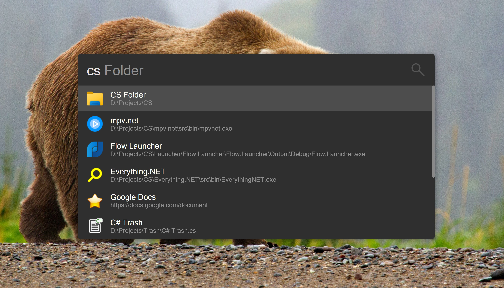


## About

Favorites is a [Flow Launcher](https://flow-launcher.github.io/#/) plugin to
define favorite apps, files, folders, URLs and command lines.

Launcher apps typically find all installed apps, the Favorites plugin is
different, it let's users define apps using a conf file, this has the great
advantage getting clean results that are not cluttered with never used entries.

Also supported are:

1. Files
2. Folders
3. URLs
4. Command lines

## Usage

Extract the files in the release and put them at:

`C:\Users\JonDoe\AppData\Roaming\FlowLauncher\Plugins\Flow.Launcher.Plugin.Favorites`

Create the definition file at:

`C:\Users\JonDoe\AppData\Roaming\FlowLauncher\Settings\Favorites.conf`

Or create it in the portable settings folder if you use portable mode.

Here is an example configuration:

```
Favorites = C:\Users\JonDoe\AppData\Roaming\FlowLauncher\Settings\Favorites.conf
VS Code = C:\Users\JonDoe\AppData\Local\Programs\Microsoft VS Code\Code.exe
CPP Folder = C:\My Projects\CPP
To Do = C:\Users\JonDoe\OneDrive\Documents\To Do.txt
Google = https://www.google.de
Last system events = wt -- powershell -nologo -noexit -command get-eventlog system | select -first 500
Wheater (Store/UWP/MSIX) = C:\Users\JonDoe\OneDrive\Shortcuts\Weather.lnk
```

Pressing the Ctrl key does not open a file but instead the folder of the file.

There is a context menu to copy to the clipboard and to run as admin.

It's a huge task to define all apps, files, folders, URLs and command lines manually,
the great reward is getting clean results that are not cluttered with never used entries,
there is full control over the results. Personally I use only two plugins:
Favorites (Alt+Space) and Browser Bookmarks (Shift+Space, b keyword).

Tip 1: To edit the favorites conf file use an awesome text editor such as VS Code
(my favorite), Sublime Text or NeoVim. Put new entries on top so you don't have
to navigate to the bottom all the time. After editing the conf file refresh the
definitions by pressing F5 in Flow Launchers main window.

Tip 2: For Microsoft Store (UWP/MSIX) apps navigate File Explorer to `Shell:AppsFolder`,
in there you can search for apps and create shortcuts (.lnk files) using the context menu.



## Links

https://www.winhelponline.com/blog/shell-commands-to-access-the-special-folders

https://www.tenforums.com/tutorials/77458-rundll32-commands-list-windows-10-a.html

https://www.ghacks.net/2017/06/10/windows-msc-files-overview

https://support.microsoft.com/de-de/topic/how-to-run-control-panel-tools-by-typing-a-command-bce95b4d-e8c2-1cd0-ee0d-027679d520a6

https://docs.microsoft.com/en-us/windows/uwp/launch-resume/launch-settings-app
